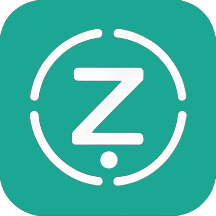
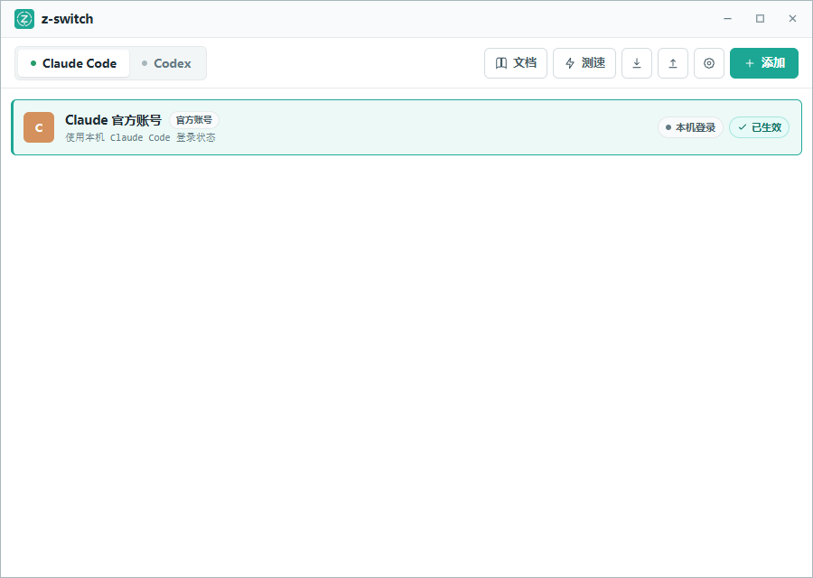

<div align="center">



# z-switch

**面向 Claude Code 与 Codex 的桌面供应商一键切换器**

由 真测 Ztest · [ztest.ai](https://ztest.ai) 出品 · 开源 · 无广告 · 无返利链接

<p>
  
  
  
  
  
  
  
</p>

</div>

---

## 简介

**z-switch** 让你在多个 API 中转站 / 官方账号之间，为 Claude Code 和 Codex 快速切换供应商。

它提供两种工作方式：

- **直连模式（默认）** — 直接、原子化地改写客户端配置文件，切换后由客户端本身生效，零中间层。
- **本地路由模式（实验）** — 启动一个 `localhost` 代理，让你在**进程运行期间热切换**目标供应商，无需重启客户端。

项目坚持**开源、无广告、无返利链接**，当前专注于把「切换」这一核心能力做扎实；MCP、技能（Skills）等扩展功能也可能在后续版本中逐步加入。

> ⚠️ **隐私优先**：所有配置和快照都保存在本地。真实测试内容、模型回复与 API Key **不写入任何持久化文件**。

<div align="center">
  
</div>

---

## 目录

- [核心特性](#核心特性)
- [赞助商](#-赞助商)
- [快速开始](#快速开始)
- [使用指南](#使用指南)
- [工作原理](#工作原理)
- [数据与文件位置](#数据与文件位置)
- [安全与隐私](#安全与隐私)
- [开发](#开发)
- [项目结构](#项目结构)
- [致谢](#致谢)
- [许可](#许可)

---

## 核心特性

| 分类 | 能力 |
| --- | --- |
| **供应商管理** | Claude Code / Codex 分区管理、一键切换；自定义供应商的添加、复制、编辑、删除；表单与 JSON 两种编辑方式 |
| **开箱即用** | 内置 Claude / OpenAI 官方账号卡片，可与任意 API 中转站来回切换；首次启动自动保留并导入已有的 `~/.claude` / `~/.codex` 配置 |
| **多档模型** | Claude 支持主模型与 Haiku / Sonnet / Opus / Fable 四档独立配置；Codex 可选 `responses` 或 `chat` 协议 |
| **供应商体检** | Base URL 智能推断、连通性测试、模型列表拉取、TCP 测速，以及发送最小流式 `Hi` 的**真实调用测试**（显示首字耗时与总耗时） |
| **配置安全** | 独立原始快照、一键恢复、原子写入、写前备份、Codex 双文件回滚、切换前 backfill，避免手工改动丢失 |
| **系统集成** | 系统托盘、单实例、窗口状态记忆、开机自启、深链 `zswitch://import`；关闭 / Alt+F4 最小化到托盘，托盘菜单「退出」才结束进程 |
| **外观** | 浅色 / 深色 / 跟随系统主题 |
| **本地代理（实验）** | `localhost` 转发请求与流式响应，运行期间热切换目标，附超时 / 连接池 / 请求体上限 / 脱敏错误日志 |

---

## ❤️ 赞助商

感谢以下伙伴对 z-switch 的支持。本项目坚持无广告、无返利链接，赞助板块仅展示真实合作方。

<table>
  <tr>
    <td width="180"><a href="https://ztest.ai"></a></td>
    <td>本项目由 <a href="https://ztest.ai">真测 Ztest（ztest.ai）</a> 出品并支持！真测是一个 AI 中转站模型验真平台，检测结果完全公开。采用 23 个探针，覆盖<b>协议、身份、能力、内容完整性、安全、性能</b>六大维度，通过交叉验证识别伪造与降智，作为独立第三方持续监测各 AI 中转站的模型真实性、响应质量与服务可用性。点击<a href="https://ztest.ai">此链接</a>了解更多！</td>
  </tr>
  <!--
  复制下面这一整段 <tr>…</tr> 即可新增一个赞助商（把 LOGO、链接、名称、介绍换成对应内容）：
  <tr>
    <td width="180"><a href="赞助商链接"></a></td>
    <td>感谢 赞助商名称 赞助了本项目！这里写一段介绍……点击<a href="赞助商链接">此链接</a>注册！</td>
  </tr>
  -->
</table>

> 想成为 z-switch 的赞助商？欢迎通过 [ztest.ai](https://ztest.ai) 与我们联系。

---

## 快速开始

### 下载安装

前往 [Releases](https://github.com/ZtestAi/z-switch/releases) 下载对应平台的安装包，或参考 [开发](#开发) 从源码自行构建。

### 30 秒上手

1. **首次启动** — z-switch 自动保存本机 Claude Code / Codex 原始配置，建立默认「官方账号」卡片；检测到已有中转配置会自动导入并设为当前项。
2. **添加供应商** — 点击右上角「添加」，填写名称、Base URL 和 API Key，随后可测试连通性、拉取模型并测速。
3. **切换** — 点击供应商卡片上的「切换」，直连模式会立即写入客户端配置。
4. **验证（可选）** — 点「真实测试」，选择模型并发送一条最小 `Hi` 请求，实时查看回复、首字耗时与总耗时。

> 真实测试会产生极少量模型调用费用；本地路由目前不提供自动重试或故障转移。

---

## 使用指南

> 📖 完整使用教程见 **[docs/USAGE.md](./docs/USAGE.md)**（安装、添加供应商、切换、本地路由代理、FAQ 等）。下面是精简流程。

<details>
<summary><strong>展开完整流程</strong></summary>

1. 首次启动时，z-switch 会先保存本机 Claude Code / Codex 原始配置，并为两个应用建立默认「官方账号」卡片；检测到现有中转配置时会自动导入并设为当前项。
2. 点击右上角「添加」，填写供应商名称、Base URL 和 API Key；随后可测试连通性、拉取模型并测速。
3. Claude 供应商可分别配置主模型以及 Haiku、Sonnet、Opus、Fable 四个模型档位；Codex 供应商可选择 `responses` 或 `chat` 协议。
4. 保存后点击供应商卡片上的「切换」，直连模式会写入客户端配置；真实测试图标可选择模型并发送一条最小流式 `Hi` 请求。
5. 如需运行期间热切换，可在设置中开启「本地路由代理」；高级设置提供超时、连接复用、请求体限制和错误日志。
6. 遇到问题时，可在设置中打开错误日志目录；需要退出 z-switch 管理时，可恢复首次保存的本机原始配置。

**关于「真实测试」**：每个 API 中转站卡片都提供该入口，使用已保存的地址、密钥、模型和协议，向供应商发送一条 `Hi`（最多输出 32 tokens），在独立弹窗中实时显示回复、首字耗时与总耗时。测试结果仅在本次运行中回显到卡片；请求可能产生极少量模型调用费用，测试内容、回复与密钥均**不写入日志或持久化文件**。

</details>

---

## 工作原理

### 直连模式（默认）

切换时，z-switch 直接改写客户端配置文件：

- **Claude** — 合并写入 `~/.claude/settings.json` 的 `env`，保留其他顶层字段。
- **Codex** — 写入 `~/.codex/auth.json` 与 `~/.codex/config.toml`；第二个文件写入失败时回滚 `auth`。
- **官方账号卡片不保存 API Key** — Claude 清除中转环境变量、改用客户端本机登录；Codex 切走前保存客户端刷新后的登录态，切回时恢复。
- **切换前 backfill** — 把当前 live 配置回填到旧供应商，避免手工修改丢失。
- **安全删除** — 删除正在使用的供应商时，可选择恢复首次原始配置，或保留电脑当前配置、仅解除 z-switch 管理。

首次运行会把原始文件完整保存在 `~/.z-switch/original/`。该快照独立于供应商列表和普通 JSON 导出，可在设置页分别恢复 Claude Code 或 Codex；恢复前仍会保存一份时间戳备份。

> Claude Code 通常在下一次请求时读取新配置；Codex CLI 可能需要重启。

### 本地路由模式（实验）

开启后，z-switch 监听 `127.0.0.1:8899`（可由配置覆盖），并把两个客户端的 live Base URL 分别指向：

- `http://127.0.0.1:8899/claude`
- `http://127.0.0.1:8899/codex`

代理会根据当前 API 中转站注入对应鉴权信息并转发请求——**不修改请求体、不做协议转换、不记录用量**。切换中转站时立即更新上游 Base URL 与鉴权信息；官方账号始终保持客户端直连，另一个应用仍可继续使用本地代理。设置页可配置连接 / 首段 / 流静默 / 非流式超时、请求体硬上限、连接池与 TCP Keepalive；流式返回与连接复用始终开启。

失败请求会按设置写入 `~/.z-switch/logs/proxy-errors.jsonl`，仅记录上游状态、脱敏 URL、失败阶段和截断后的错误详情，**不记录请求正文**。日志自动脱敏当前供应商密钥并按文件大小轮转，可在设置页打开目录或清空。

> **已知限制**：当前不会同步改写开启代理时已落入 live 配置的模型名和 Codex `wire_api`。因此热切换只适用于模型 / 协议兼容的供应商；跨模型或跨协议切换仍需关闭代理后直连切换。该模式仍需用真实供应商持续验证路径、鉴权头和流式响应兼容性。

---

## 数据与文件位置

| 路径 | 内容 |
| --- | --- |
| `~/.claude/settings.json` | Claude Code 客户端配置（直连模式写入 `env`） |
| `~/.codex/auth.json`、`~/.codex/config.toml` | Codex 客户端配置（直连模式写入） |
| `~/.z-switch/original/` | 首次运行保存的**原始配置快照**，可随时恢复 |
| `~/.z-switch/logs/proxy-errors.jsonl` | 本地代理的脱敏错误日志（按大小轮转） |

---

## 安全与隐私

- 所有数据均保存在**本地**，无云端上传、无遥测。
- 真实测试的**内容、模型回复与 API Key 不写入任何持久化文件**。
- 代理错误日志自动**脱敏密钥**，且不记录请求正文。
- 所有配置写入均为**原子操作**并在写前备份，最大限度避免破坏原有环境。
- 项目**无广告、无返利链接**，官方账号卡片不保存任何 API Key。

---

## 开发

**环境要求**

- Node.js `20.19+` 或 `22.12+`
- Rust stable
- Windows 需安装 Tauri 所需的 WebView2 与 MSVC 构建工具

**本地运行**

```bash
npm install
npm run tauri dev
```

**常用检查**

```bash
npm run build

cd src-tauri
cargo clippy --all-targets --all-features
cargo test
```

**构建可执行文件**

```bash
npm run tauri build -- --no-bundle
```

---

## 项目结构

```text
src/                        前端（React 19 + TypeScript）
  App.tsx                   主界面、切换、深链和状态同步
  ProviderModal.tsx         供应商表单、连通性、密钥和模型选择
  SettingsModal.tsx         主题、自启、本地路由等设置
  providerFactory.ts        Provider 构建器和地址推断规则
  api.ts / types.ts         Tauri 命令封装与前端类型

src-tauri/src/              后端（Rust + Tauri 2）
  lib.rs                    Tauri 命令、状态和切换流程
  config.rs                 路径与原子写入
  store.rs                  providers.json 数据模型
  live.rs                   Claude/Codex live 配置读写
  proxy.rs                  本地代理和热切换目标
  connectivity.rs           HTTP 连通性检查
  model_fetch.rs            模型列表拉取
  speed.rs                  TCP 测速
  tray.rs                   系统托盘
```

---

## 致谢

- [**cc-switch**](https://github.com/farion1231/cc-switch)（MIT，Copyright © 2025 Jason Young）—— z-switch 的设计与实现参考了该项目，特此致谢。

## 许可

本项目基于 [MIT License](./LICENSE) 开源，可自由用于个人与商业用途，只需保留版权与许可声明。

项目参考了同为 MIT 许可的 cc-switch，其原始版权声明已一并保留在 [`LICENSE`](./LICENSE) 中。

---

<div align="center">

由 **真测 Ztest** 用心打造 · [ztest.ai](https://ztest.ai)

如果这个项目对你有帮助，欢迎点一个 ⭐️

</div>
